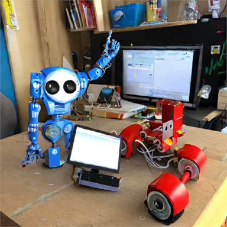
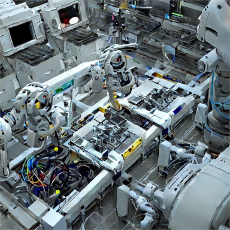
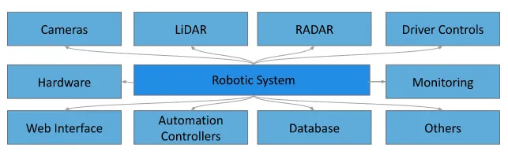
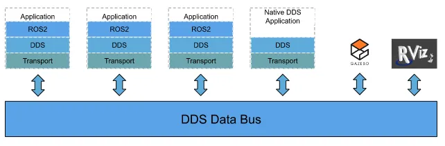
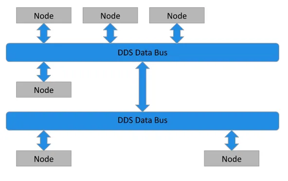

# Intro



## Мотивация 

Чтобы разобраться в том, как устроены роботы, спросим самих роботов, что они думают о своём внутреннем устройстве ^_^ Вот как выглядит робот изнутри по мнению Stable Diffusion



Если задуматься, то описание выглядит довольно точно: робот изнутри выглядит сложная техническая система, состоящая из различных компонетов, которые как-то между собой связаны. Применив силу воображения и магию абстрации, можно перерисовать картинку более понятным для человеков образом.



Получившаяся схема позволяет победить визуальный хаос, а также сформулировать одну из важнейших проблем современной робототехники: каким образом обеспечить взаимодействие между компонентами робота, чтобы обмен информацей происходил быстро, надежно и просто? 

Достаточно естественно выглядит решение реализовать компонент, ответственный только за обмен данными между другими компонентами робота. Таким компонентом является система ROS (Robotic Operation System). Она предлагает интерфейс и механизм обмена данными, заточенный на робототехнику.


## ROS2

В настоящее время существует две версии ROS. Они имеют различную архитектуру, нас в первую очередь будет интересовать ROS2. 

ROS2 реализует только интерфейс обмена данными и может использовать различные каналы передачи информации на основе DDS (Data Distribution System). 



DDS самостоятельно обеспечивает развертывание канала передачи данных на вычислительных платформах, а ROS2 создает узлы, обменивающиеся между собой информацией.



В этот раз мы не говорим подробно о DDS, но обсудим устройство основных элементов ROS2.


## Основные компоненты ROS

### Внутренняя кухня
https://docs.ros.org/en/humble/Concepts/About-ROS-2-Client-Libraries.html

https://docs.ros2.org/latest/api/rcl/

Необходимые для работы компоненты ROS2 лежат в библиотеках rclcpp (для C++), rclpy (для py). Также постепенно внедряется поддержка других языков. Особое положение занимает библиотека rcl. Она обеспечивает единый интерфейс между различными ЯП и механизмами ROS2. Скоро мы посмотрим, как это выглядит на практике.


### ROS Node

Нода &ndash; ключевой элемент инфраструктуры ROS. Использование нод следует принципам единой ответственности:
1) каждая нода должна включать в себя самостоятельную задачу, выполняющую единственную функцию
2) связь с другими нодами поддерживается с помощью интерфейсов обмена данными


[Официальная документация](https://docs.ros.org/en/humble/Tutorials/Beginner-CLI-Tools/Understanding-ROS2-Nodes/Understanding-ROS2-Nodes.html)

Примеры

Запустить ноду turtlesim_node из пакета turtlesim (это забавная робочерепашка)
 ```bash
ros2 run turtlesim turtlesim_node
```
Вывести список запущенных нод
```bash
ros2 node list
```
Подробная информация о ноде turtlesim_node
```bash
ros2 node info /turtlesim_node
```
Запустить ноду turtle_teleop_key из пакета turtlesim
```bash
ros2 run turtlesim turtle_teleop_key
```
Обратимся теперь к возможностям обмена данными

### ROS topic

Топик  &ndash; базовый механизм передачи информации в ROS. Работает по принципу издатель-подписчик. Ноды, которые желают сообщить какую-то информацию, создают топики и публикуют туда данные. Ноды, которые заинтересованы в этой информации, подписываются на топики и считывают оттуда данные по мере поступления.


[Официальная документация](https://docs.ros.org/en/humble/Tutorials/Beginner-CLI-Tools/Understanding-ROS2-Topics/Understanding-ROS2-Topics.html)

### Примеры

Снова запускаем черепашку 
```bash
ros2 run turtlesim turtlesim_node
ros2 run turtlesim turtle_teleop_key
```

При запуске ноды самостоятельно обнаруживают друг друга и настраивают каналы коммуникации. Это можно увидеть запустив 

```bash
rqt_graph
```

и выбрав отбражение узлового графа (Plugins > Introspection > Node Graph). Чтобы увидеть список топиков в консоли, есть команда
```bash
ros2 topic list
```

Или то же, но с указанием типов данных, которые принимают ноды
```bash
ros2 topic list -t
```

Получить подробную информацию о топике
```bash
ros2 topic info /turtle1/cmd_vel
```

```bash
ros2 interface show geometry_msgs/msg/Twist
```

При необходимости можно опубликовать сообщения в топик вручную. Для этого нужно указать топик, а также создать сообщение нужного типа
```bash
ros2 topic pub <topic_name> <msg_type> '<args>'
```

```bash
ros2 topic pub --once /turtle1/cmd_vel geometry_msgs/msg/Twist "{linear: {x: 2.0, y: 0.0, z: 0.0}, angular: {x: 0.0, y: 0.0, z: 1.8}}"
```

```bash
ros2 topic pub --rate 1 /turtle1/cmd_vel geometry_msgs/msg/Twist "{linear: {x: 2.0, y: 0.0, z: 0.0}, angular: {x: 0.0, y: 0.0, z: 1.8}}"
```

Чтобы отслеживать сообщения сообщения, приходящие в топик, может пригодиться команда echo
```bash
ros2 topic echo /turtle1/pose
```


### ROS service 
Сервисы и действия рассмотрим подробно на следующих встречах


[Официальная документация](https://docs.ros.org/en/humble/Tutorials/Beginner-CLI-Tools/Understanding-ROS2-Services/Understanding-ROS2-Services.html)

### ROS action


[Официальная документация](https://docs.ros.org/en/humble/Tutorials/Beginner-CLI-Tools/Understanding-ROS2-Actions/Understanding-ROS2-Actions.html)

### Вычислительный граф ROS

Т.о. можно представлять себе структуру ROS в форме направленного вычислительного графа. Вершины которого имеют различные типы (ноды, топики и пр.). На первых порах в этой абстракции нет ничего примечательного. Но она полезна при анализе структуры сложных систем, состоящих из большого количества узлов. Например, при обеспечении качества связи (QoS) в подграфах, требующих высокой скорости обмена данными.


## Бонус: ROS2 в контейнере

### Официальная документация
https://docs.ros.org/en/humble/Installation.html

### ROS2 в Docker

На DockerHub есть образ от OSRF

```bash
docker pull osrf/ros:humble-desktop-full
```

Базовый вариант

```bash
docker run -it \
    --name ros2 \
    --env="DISPLAY" \
    --env="QT_X11_NO_MITSHM=1" \
    --volume="/tmp/.X11-unix:/tmp/.X11-unix:rw" \
    --volume="src/ROS2:/robotics:rw" \
    osrf/ros:humble-desktop-full
```
и команда 
```bash 
xhost +local:ros2 
```
чтобы выдать разрешение контейнеру на доступ к X-серверу хост-системы. 

Когда есть видеокартна от Nvidia, полезно воспользоваться NVIDIA Container Toolkit.
https://docs.nvidia.com/datacenter/cloud-native/container-toolkit/install-guide.html#installation-guide

```bash
docker run -it \
	--name ros2 \
	--env="DISPLAY" \
	--env="QT_X11_NO_MITSHM=1" \
	--volume="/tmp/.X11-unix:/tmp/.X11-unix:rw" \
	--volume="src/ROS2:/robotics:rw" \
    --gpus all \    
	osrf/ros:humble-desktop-full
```

### Сборка собственного образа

При желании можно собрать собственный образ с помощью docker-файла. Туда можно однократно добавить набор полезных инструментов и не тратить время на их повторную установку. В качестве примера приведу свой [docker-файл](./Dockerfile)

Собрать его можно следующей командой
```bash
    docker build -t ros2_humble .
```
где ключ -t определяет название образа.
