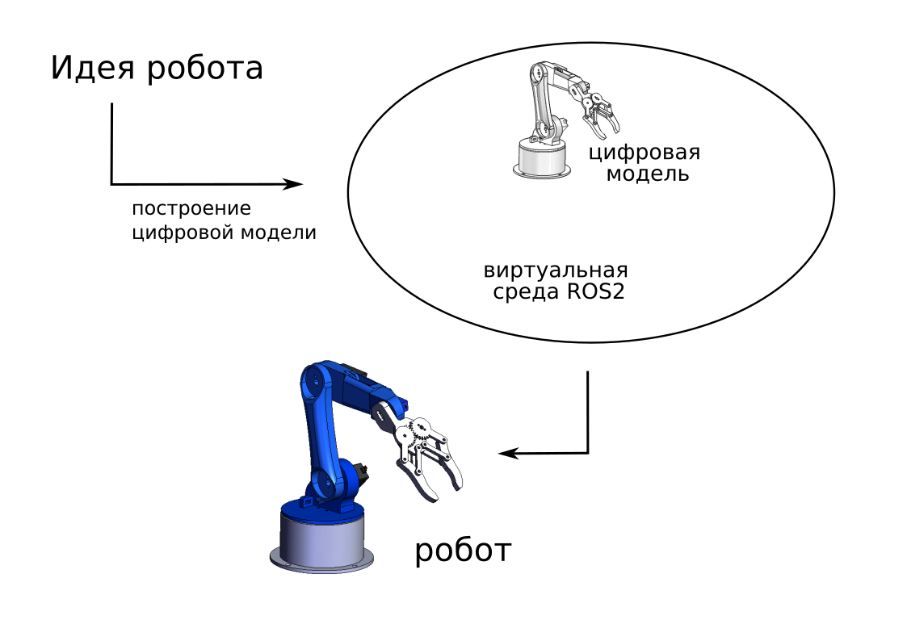
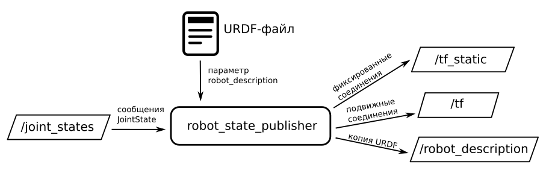
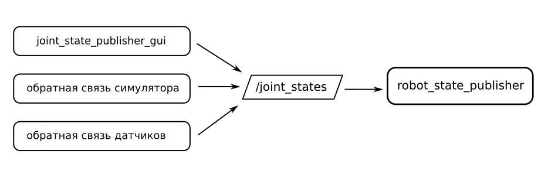
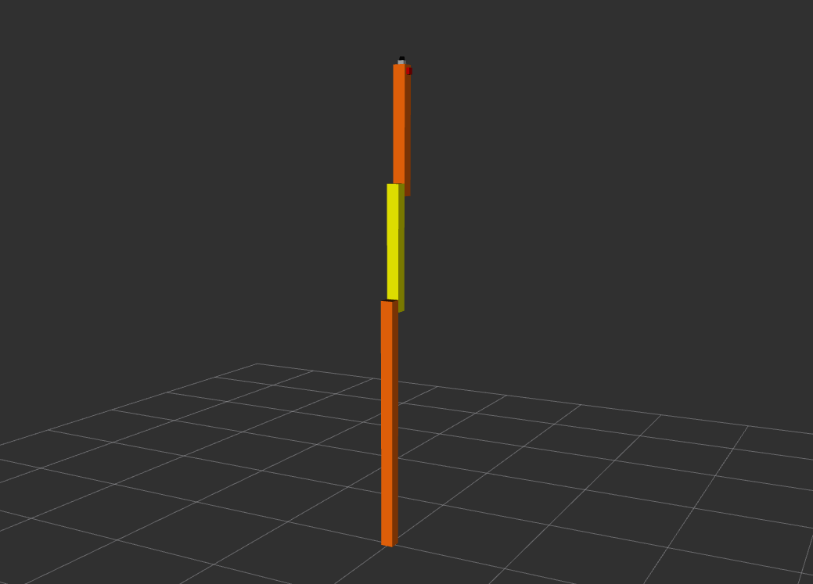

# Воображаемые роботы

Собрать настоящего робота интересно, но  не так-то просто. Это итеративный процесс, опирающийся на множество экспериментов, проб и ошибок. Впрочем, имея под рукой компьютер, можно выстраивать процесс иначе: вообразить робота своей мечты, провести компьютерную симуляцию и, оценив работоспособность концепции, приступать к воплощению проекта “в железе”.



ROS2 предоставляет широкий набор инструментов для моделирования робототехнических систем. Начнём знакомство со средств описания роботов и формата URDF (Unified Robot Description Format).  URDF-файл использует схему xml, и содержит описание структуры робота как системы твердых тел.  Основными понятиями, которыми мы оперируем, создавая URDF-модель робота, являются  сочленения (joint) и звенья (link).  URDF-файл должен содержать информацию о взаимном положении звеньев, геометрии и физических характеристиках, а также типах и ограничениях подвижных сочленений. 

Подробнее о внутренней структуре URDF-файла мы поговорим в следующий раз.  А сейчас разберемся, каким образом использовать уже готовые модели. Наша цель: передать информацию о структуре робота системе ROS, а затем изучить пути её использования. 


## Извлечение данных из URDF-модели 

Для работы нам понадобится пакет [robot_state_publisher](https://github.com/ros/robot_state_publisher), который умеет превращать информацию из URDF-модели робота в дерево преобразований tf2. 



При запуске нода  robot_state_publisher получает на вход URDF-файл, парсит его и публикует информацию в 3 топика: 
1. /robot_description - модель робота в виде одной большой строки
2. /tf_static - информация о статических преобразованиях (для связанных звеньев, которые неподвижно зафиксированы друг от друга)
3. /tf - информация о динамических преобразованиях (для связанных звеньев, которые могут перемещаться друг относительно друга)

Нода robot_state_publisher также подписывается на топик /joint_states, куда поступает информация о фактическом перемещении звеньев робота. В зависимости от этапа разработки, источником этой информации может служить
1. на этапе проектирования модели &ndash; приложение joint_state_publisher_gui 
2. на этапе тестирования в симуляторе &ndash; ноды, обеспечивающие обратную связь от ядра симулятора
3. ноды, связанные непосредственно с датчиками, когда робот уже создан




## Практика
Воспользуемся URDF-моделью простого робота, который называется [RRBot](https://github.com/carlosjoserg/rrbot/blob/master/rrbot_description/robots/single_rrbot.urdf). 



Загружаем информацию о структуре  rrbot’a  с помощью ноды robot_state_publisher. (примечание: URDF-описание необходимо передавать в виде строки!)

```bash
ros2 run robot_state_publisher robot_state_publisher --ros-args -p robot_description:="$(cat rrbot.urdf)"
```

Вот так тоже можно: 

```bash
ros2 run robot_state_publisher robot_state_publisher rrbot.urdf
```

С помощью инструмента rviz посмотрим, как выглядит загруженный робот
```bash
rviz2 
```
Чтобы иметь возможность управлять положением отдельных звеньев, запускаем ноду joint_state_publisher_gui

```bash
ros2 run joint_state_publisher_gui joint_state_publisher_gui
```
Вопрос для размышления: без ноды joint_state_publisher_gui rviz покажет какую-то ерунду. Как вы думаете, почему? (мы попробуем разобраться в этом, когда заглянем внуть URDF-файла)

### Упражнения
1. Выяснить структуру сообщений JointState
2. Изучить вычислительный граф и дерево преобразований RRBot'a.


## Дополнительные материалы

[Getting Ready for ROS Part 6: The Transform System (TF)](
https://articulatedrobotics.xyz/ready-for-ros-6-tf/)

[Формат URDF](http://wiki.ros.org/urdf/XML/model)

[URDF-файл с RRBot'ом](https://github.com/carlosjoserg/rrbot/blob/master/rrbot_description/robots/single_rrbot.urdf)

[Difference Between the Robot State Publisher and the Joint State Publisher](
https://automaticaddison.com/robot-state-publisher-vs-joint-state-publisher/)

## Решение упражнений

Полное название типа JointState: sensor_msgs/msg/JointState
```bash
ros2 interface show sensor_msgs/msg/JointState
```

Структуру вычислительного графа можно увидеть с помощью команды rqt, подключив плагин tf_tree
```bash
rqt 
```