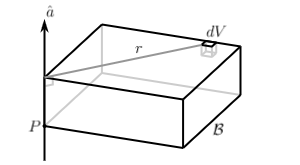
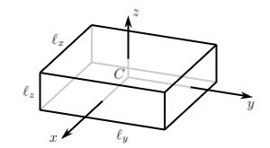
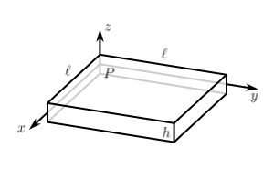
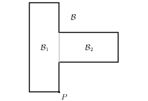
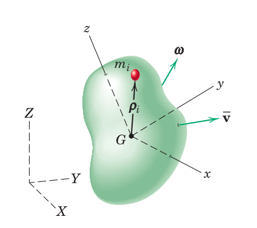

# Физические характеристики URDF-модели

Безуспешная загрузка минимальной модели в Gazebo  
Превращение URDF без физических характеристик в пустой SDF  
SDF и Gazebo  
Как считать инерциальные характеристики? (+самостоятельное задание)
* вручную
* с помощью FreeCAD
* официальный способ ROS
* proposal SDF
* загадка оригинального rrbot'a
Дополнение: модель столкновений

## 0. Введение: модель, которая не работает в симуляторе

## 1. Момент инерции

**Момент инерции** (инерция вращения) твердого тела &ndash; это физическая величина, определяющая момент силы, необходимый, чтобы придать телу желаемое угловое ускорение вокруг выбранной оси вращения. Является аналогом массы при линейном движении. Момент инерции характеризуется распределением массы в теле.



Поэтому, чтобы отыскать его значение, в первую очередь нужно задать 2 параметра: точку в пространстве P и проходящую через неё ось вращения $\hat{a}$. Затем необходимо найти произведения элементов массы тела на расстояние до выбранной оси и просуммировать по всему объему. Описанные действия можно записать в виде интеграла

$$ I_{P,\hat{a}} = \int_V \rho r^2 dV  \quad \quad (0), $$

где $\rho$ &ndash; плотность, dV &ndash; элемент объема тела.


Если связать с точкой P систему координат xyz, то моменты инерции вокруг каждой из осей можно записать вот так

$$ I_{P,xx} = \int_V \rho (y^2 + z^2) dx dy dz \quad \quad (1) $$
$$ I_{P,yy} = \int_V \rho (z^2 + x^2) dx dy dz \quad \quad (2) $$
$$ I_{P,zz} = \int_V \rho (x^2 + y^2) dx dy dz \quad \quad (3) $$

где значения координат (x,y,z) определяются по отношению к началу координат, т.е. по отношению к точке P.

### Самостоятельно задание

Самое время воспользоваться полученными знаниями и отыскать моменты инерции прямоугольной призмы относительно базисных осей с.к. xyz



#### Подсказка №1
Необходимо воспользоваться координатными представлениями моментов, приведенными выше, и понять, как должны выглядеть пределы интегрирования.

#### Подсказка №2
Чтобы конечная формула зависела от массы, нужно заметить, что $m = \rho l_x l_y l_z$.

## Свойства моментов инерции 

Момент инерции всегда можно вычислить с помощью интегрирования, но для сложных тел и "неудобных" осей имеет смысл проводить вычисления в более "удобных" точках, а потом перемещать или складывать их, пользуясь специальными свойствами этой физической величины.

### Теорема о параллельном переносе оси (т. Гюйгенса-Штайнера)

Момент инерции, вычисленный относительно центра масс вдоль оси $\hat{a}$ можно перенести в произвольную точку P, сохранив при этом направление оси вращения следующим образом

$$ I_{P,\hat{a}} = I_{C,\hat{a}} + md^2 \quad \quad (4) $$ 

m &ndash; масса тела,  d &ndash; расстояние между осями.

Т.к. величина $md^2$ всегда положительна, момент инерции относительно центра масс имеет наименьшее значение.

### Самостоятельное задание

Точка P смещена относительно центра масс призмы. Необходимо вычислить момент инерции $I_{P,zz}$



#### Подсказка 
Можно воспользоваться теоремой о параллельном переносе и/или вычислить интеграл (4), где x и y меняются от 0 до l, а z от -h/2 до h/2.


### Теорема о суммировании моментов инерции

Момент инерции сложного тела можно представить в виде суммы моментов более простых его частей, вычисленных относительно одной и той же точки.



$$ I_{P,\hat{a} } (B) = I_{P,\hat{a} } (B_1) + I_{P,\hat{a} } (B_2) \quad \quad (5) $$

На рис. тело B мысленно разделено на 2 части, для каждой из которых вычислен момент инерции относительно оси $\hat{a}$ в точке P. Такое поведение прямо следует из аддитивности интеграла. 


## 2. Тензор инерции 

На практике нам понадобятся набор моментов инерции вокруг базисных осей твердого тела, который называется тензором инерции. С его помощью мы можем рассчитывать энергетические характеристики тела, например, связать момент импульса угловой скоростью.

Разберем, как строится тензор инерции. Пусть в системе координат XYZ движется тело, с которым связана собственная с.к. xyz. Тело имеет линейную скорость **v** и вращается с угловой скоростью **w**. Точка G является центром масс. 



<details><summary> Примечание </summary>
<p>

1) символы, выделенные жирным шрифтом, являются векторами, символы без выделения &ndash; скаляры.
2) вместо греческих символов $\omega$ (угловая скорость) и $\rho$ (расстояние) в формулах используются **w** и **r**.

</p>
</details>


По определению момента импульса (относительно центра масс G в с.к. XYZ)

$$H_G = \sum \left( \mathbf{r_i} \times m_i \mathbf{v_i} \right) \quad \quad (6) $$ 

где скорость $\mathbf{v}_i$ состоит из двух компонент: линейной скорости всего тела и угловой скорости вращения относительно центра масс

$$ \mathbf{v}_i = \mathbf{v} + \mathbf{w} \times \mathbf{r}_i \quad \quad (7) $$

тогда выражение для момента импульса примет вид суммы:

$$ H_G = \sum (\mathbf{r}_i m_i) \times \mathbf{v_i} + \sum ( \mathbf{r}_i \times m_i (\mathbf{w} \times \mathbf{r}_i )) \quad \quad (8)$$

Первое слагаемое равно нулю, т.к. для центра масс $ \sum m_i \mathbf{r}_i = 0 $, а второе слагамое мы можем превратить в интеграл, совершив предельный переход от $m_i$ к $dm$:

$$ H_G = \int_V (\mathbf{r} \times (\mathbf{w} \times \mathbf{r}))dm  \quad \quad (9) $$

<details><summary>Примечание</summary>
<p>

Такое же выражение получится, если вращение будет происходить не относительно движущегося центра масс, а относительно любой неподвижно зафиксированной точки тела О.

</p>
</details>

Под интегралом (6) стоит двойное векторное произведение. Чтобы понять, как им можно воспользоваться для непосредственных вычислений, мы должны перейти от общей формулировки к координатному представлению.ы

Для начал вспомним, что **r** &ndash;  это вектор от центра масс G до точки произвольной точки тела, а **w** &ndash; вектор угловой скорости, т.е. задает ось, проходящую через центр масс, вокруг которой происходит вращение в данный момент. Поэтому каждый из этих объектов можно задать набором координат в с.к. xyz (связанной с телом): **r** = $[x,y,z]$, **w** = $[w_x, w_y, w_z]$. 

А дальше добавим ещё пару фактов из [линейной алгебры](https://en.wikipedia.org/wiki/Cross_product): 
1. Векторное произведение антикоммутативно, то есть при смена порядка сомножителей меняется его знак

$$ \mathbf{w} \times \mathbf{r} = - \mathbf{r} \times \mathbf{w} $$

2. Просто так скобки двойного векторного произведения раскрывать нельзя, потому что оно не является ассоциативным и удовлетворяет [тождеству Якоби](https://en.wikipedia.org/wiki/Jacobi_identity), но мы можем использовать уловку представления векторного произведения в виде матричного умножения!

$$
\mathbf{r} \times \mathbf{w} = 
\begin{bmatrix}
  0 & -x & y \\
  x & 0 & -z \\
  -y & z & 0
\end{bmatrix}
\begin{bmatrix}
  w_x \\
  w_y \\
  w_z
\end{bmatrix}
$$

Т.о. выражение под интегралом (6) можно немного реорганизовать

$$ \mathbf{r} \times (\mathbf{w} \times \mathbf{r}) = -  \mathbf{r} \times ( \mathbf{r} \times \mathbf{w}) $$

переписать в матричном виде

$$
-\mathbf{r} \times (\mathbf{r} \times \mathbf{w}) = 
-\begin{bmatrix}
  0 & -x & y \\
  x & 0 & -z \\
  -y & z & 0
\end{bmatrix}
\begin{bmatrix}
  0 & -x & y \\
  x & 0 & -z \\
  -y & z & 0
\end{bmatrix}
\begin{bmatrix}
  w_x \\
  w_y \\
  w_z
\end{bmatrix} = 
$$

и аккуратно выполнить умножение
 
$$
= \begin{bmatrix}
  0 & x & -y \\
  -x & 0 & z \\
  y & -z & 0
\end{bmatrix}
\begin{bmatrix}
  0 & -x & y \\
  x & 0 & -z \\
  -y & z & 0
\end{bmatrix}
\begin{bmatrix}
  w_x \\
  w_y \\
  w_z
\end{bmatrix} = 
\begin{bmatrix}
  y^2 + z^2 & -xy & -xz \\
  -xy & x^2 + z^2 & -yz \\
  -xz & -yz & x^2 + y^2
\end{bmatrix}
\begin{bmatrix}
  w_x \\
  w_y \\
  w_z
\end{bmatrix} \quad (10)
$$

Подставив выражение (10) в интеграл (6), получаем формулу, которой уже можно пользоваться для вычисления моментов инерции на практике

$$ H_G =  \int \begin{bmatrix}
  y^2 + z^2 & -xy & -xz \\
  -xy & x^2 + z^2 & -yz \\
  -xz & -yz & x^2 + y^2
\end{bmatrix}
\begin{bmatrix}
  w_x \\
  w_y \\
  w_z
\end{bmatrix} dm = 
 \left(  \int \begin{bmatrix}
  y^2 + z^2 & -xy & -xz \\
  -xy & x^2 + z^2 & -yz \\
  -xz & -yz & x^2 + y^2
\end{bmatrix} dm \right)
\begin{bmatrix}
  w_x \\
  w_y \\
  w_z
\end{bmatrix} = 
$$

Но мы ещё немного преобразуем её, чтобы перейти к нотации тензора инерции

$$ = 
\begin{bmatrix}
  \int (y^2 + z^2)dm  & -\int xy \; dm & - \int xz \; dm \\
  -\int xy \; dm &  \int (x^2 + z^2) dm & - \int yz \; dm \\
  -\int xz \; dm & -\int yz \; dm & \int (x^2 + y^2) dm
\end{bmatrix} 
\begin{bmatrix}
  w_x \\
  w_y \\
  w_z
\end{bmatrix} = 
\begin{bmatrix}
  I_{xx} & -I_{xy} & -I_{xz} \\
  -I_{yx} & I_{yy} & -I_{yz} \\
  -I_{zx} & -I_{zy} & I_{zz}
\end{bmatrix}
\begin{bmatrix}
  w_x \\
  w_y \\
  w_z
\end{bmatrix}
$$

Выражение (11) и есть нужный нам тензор инерции

$$
\begin{bmatrix}
  I_{xx} & -I_{xy} & -I_{xz} \\
  -I_{yx} & I_{yy} & -I_{yz} \\
  -I_{zx} & -I_{zy} & I_{zz}
\end{bmatrix} \quad \quad (11)
$$

### Самостоятельное задание 

Найти тензор инерции 

### Дополнительные материалы


[Moments of inertia](https://dynref.engr.illinois.edu/rem.html)

[Macro FCInfo](https://wiki.freecad.org/Macro_FCInfo)

[How to Calculate Moment of Inertia of Model and Paste to Spreadsheet](https://www.youtube.com/watch?v=h6S0lKXxD3s)


<details><summary>rrbot.urdf </summary>
<p>

```xml
<?xml version="1.0" ?>

<robot name="single_rrbot" xmlns:xacro="http://www.ros.org/wiki/xacro">
  <!-- Import your models -->
  <material name="RRBOT/black">
    <color rgba="0.0 0.0 0.0 1.0"/>
  </material>
  <material name="RRBOT/blue">
    <color rgba="0.0 0.0 0.8 1.0"/>
  </material>
  <material name="RRBOT/green">
    <color rgba="0.0 0.8 0.0 1.0"/>
  </material>
  <material name="RRBOT/grey">
    <color rgba="0.2 0.2 0.2 1.0"/>
  </material>
  <material name="RRBOT/orange">
    <color rgba="1.0 0.423529411765 0.0392156862745 1.0"/>
  </material>
  <material name="RRBOT/brown">
    <color rgba="0.870588235294 0.811764705882 0.764705882353 1.0"/>
  </material>
  <material name="RRBOT/red">
    <color rgba="0.8 0.0 0.0 1.0"/>
  </material>
  <material name="RRBOT/white">
    <color rgba="1.0 1.0 1.0 1.0"/>
  </material>

  <!-- Build your comprehensive robot -->
  <link name="world"/>
  <gazebo reference="world">
    <static>true</static>
  </gazebo>

  <joint name="single_rrbot_fixed" type="fixed">
    <origin rpy="0 0 0" xyz="0 0 0"/>
    <parent link="world"/>
    <child link="single_rrbot_link1"/>
  </joint>

  <link name="single_rrbot_link1">
    <collision>
      <origin rpy="0 0 0" xyz="0 0 1.0"/>
      <geometry>
        <box size="0.1 0.1 2"/>
      </geometry>
    </collision>
    <visual>
      <origin rpy="0 0 0" xyz="0 0 1.0"/>
      <geometry>
        <box size="0.1 0.1 2"/>
      </geometry>
      <material name="RRBOT/orange"/>
    </visual>
    <inertial>
      <origin rpy="0 0 0" xyz="0 0 1.0"/>
      <mass value="1"/>
      <inertia ixx="1.0" ixy="0.0" ixz="0.0" iyy="1.0" iyz="0.0" izz="1.0"/>
    </inertial>
  </link>

  <joint name="single_rrbot_joint1" type="continuous">
    <parent link="single_rrbot_link1"/>
    <child link="single_rrbot_link2"/>
    <origin rpy="0 0 0" xyz="0 0.1 1.95"/>
    <axis xyz="0 1 0"/>
    <dynamics damping="0.7"/>
  </joint>

  <link name="single_rrbot_link2">
    <collision>
      <origin rpy="0 0 0" xyz="0 0 0.45"/>
      <geometry>
        <box size="0.1 0.1 1"/>
      </geometry>
    </collision>
    <visual>
      <origin rpy="0 0 0" xyz="0 0 0.45"/>
      <geometry>
        <box size="0.1 0.1 1"/>
      </geometry>
      <material name="RRBOT/black"/>
    </visual>
    <inertial>
      <origin rpy="0 0 0" xyz="0 0 0.45"/>
      <mass value="1"/>
      <inertia ixx="1.0" ixy="0.0" ixz="0.0" iyy="1.0" iyz="0.0" izz="1.0"/>
    </inertial>
  </link>

  <joint name="single_rrbot_joint2" type="continuous">
    <parent link="single_rrbot_link2"/>
    <child link="single_rrbot_link3"/>
    <origin rpy="0 0 0" xyz="0 0.1 0.9"/>
    <axis xyz="0 1 0"/>
    <dynamics damping="0.7"/>
  </joint>

  <link name="single_rrbot_link3">
    <collision>
      <origin rpy="0 0 0" xyz="0 0 0.45"/>
      <geometry>
        <box size="0.1 0.1 1"/>
      </geometry>
    </collision>
    <visual>
      <origin rpy="0 0 0" xyz="0 0 0.45"/>
      <geometry>
        <box size="0.1 0.1 1"/>
      </geometry>
      <material name="RRBOT/orange"/>
    </visual>
    <inertial>
      <origin rpy="0 0 0" xyz="0 0 0.45"/>
      <mass value="1"/>
      <inertia ixx="1.0" ixy="0.0" ixz="0.0" iyy="1.0" iyz="0.0" izz="1.0"/>
    </inertial>
  </link>

  <joint name="single_rrbot_hokuyo_joint" type="fixed">
    <axis xyz="0 1 0"/>
    <origin rpy="0 0 0" xyz="0 0 0.975"/>
    <parent link="single_rrbot_link3"/>
    <child link="single_rrbot_hokuyo_link"/>
  </joint>

  <link name="single_rrbot_hokuyo_link">
    <collision>
      <origin rpy="0 0 0" xyz="0 0 0"/>
      <geometry>
        <box size="0.1 0.1 0.1"/>
      </geometry>
    </collision>
    <visual>
      <origin rpy="0 0 0" xyz="0 0 0"/>
      <geometry>
        <mesh filename="package://rrbot_description/model/meshes/hokuyo.dae"/>
      </geometry>
    </visual>
    <inertial>
      <mass value="1e-5"/>
      <origin rpy="0 0 0" xyz="0 0 0"/>
      <inertia ixx="1e-6" ixy="0" ixz="0" iyy="1e-6" iyz="0" izz="1e-6"/>
    </inertial>
  </link>

  <joint name="single_rrbot_camera_joint" type="fixed">
    <axis xyz="0 1 0"/>
    <origin rpy="0 0 0" xyz="0.05 0 0.9"/>
    <parent link="single_rrbot_link3"/>
    <child link="single_rrbot_camera_link"/>
  </joint>
  
  <link name="single_rrbot_camera_link">
    <collision>
      <origin rpy="0 0 0" xyz="0 0 0"/>
      <geometry>
        <box size="0.05 0.05 0.05"/>
      </geometry>
    </collision>
    <visual>
      <origin rpy="0 0 0" xyz="0 0 0"/>
      <geometry>
        <box size="0.05 0.05 0.05"/>
      </geometry>
      <material name="RRBOT/red"/>
    </visual>
    <inertial>
      <mass value="1e-5"/>
      <origin rpy="0 0 0" xyz="0 0 0"/>
      <inertia ixx="1e-6" ixy="0" ixz="0" iyy="1e-6" iyz="0" izz="1e-6"/>
    </inertial>
  </link>  
</robot>
```

</p>
</details>

## xacro-модель

<details><summary>rrbot.urdf.xacro</summary>
<p>

```xml
<?xml version="1.0"?>
<!-- Revolute-Revolute Manipulator -->
<robot name="rrbot" xmlns:xacro="http://www.ros.org/wiki/xacro">
  <material name="black">
    <color rgba="0.0 0.0 0.0 1.0"/>
  </material>
  <material name="blue">
    <color rgba="0.0 0.0 0.8 1.0"/>
  </material>
  <material name="green">
    <color rgba="0.0 0.8 0.0 1.0"/>
  </material>
  <material name="grey">
    <color rgba="0.2 0.2 0.2 1.0"/>
  </material>
  <material name="orange">
    <color rgba="1.0 0.423529411765 0.0392156862745 1.0"/>
  </material>
  <material name="brown">
    <color rgba="0.870588235294 0.811764705882 0.764705882353 1.0"/>
  </material>
  <material name="red">
    <color rgba="0.8 0.0 0.0 1.0"/>
  </material>
  <material name="white">
    <color rgba="1.0 1.0 1.0 1.0"/>
  </material>

  <!-- Constants for robot dimensions -->
  <xacro:property name="PI" value="3.1415926535897931"/>
  <xacro:property name="mass" value="1" /> <!-- arbitrary value for mass -->
  <xacro:property name="width" value="0.1" /> <!-- Square dimensions (widthxwidth) of beams -->
  <xacro:property name="height1" value="2" /> <!-- Link 1 -->
  <xacro:property name="height2" value="1" /> <!-- Link 2 -->
  <xacro:property name="height3" value="1" /> <!-- Link 3 -->
  <xacro:property name="camera_link" value="0.05" /> <!-- Size of square 'camera' box -->
  <xacro:property name="axel_offset" value="0.05" /> <!-- Space btw top of beam and the each joint -->

 <!-- Used for fixing robot to Gazebo 'base_link' -->
  <link name="world"/>

  <joint name="fixed" type="fixed">
    <parent link="world"/>
    <child link="link1"/>
  </joint>

  <!-- Base Link -->
  <link name="link1">
    <collision>
      <origin xyz="0 0 ${height1/2}" rpy="0 0 0"/>
      <geometry>
	<box size="${width} ${width} ${height1}"/>
      </geometry>
    </collision>

    <visual>
      <origin xyz="0 0 ${height1/2}" rpy="0 0 0"/>
      <geometry>
	<box size="${width} ${width} ${height1}"/>
      </geometry>
      <material name="orange"/>
    </visual>

    <inertial>
      <origin xyz="0 0 ${height1/2}" rpy="0 0 0"/>
      <mass value="${mass}"/>
      <inertia
	  ixx="${mass / 12.0 * (width*width + height1*height1)}" ixy="0.0" ixz="0.0"
	  iyy="${mass / 12.0 * (height1*height1 + width*width)}" iyz="0.0"
	  izz="${mass / 12.0 * (width*width + width*width)}"/>
    </inertial>
  </link>

  <joint name="joint1" type="continuous">
    <parent link="link1"/>
    <child link="link2"/>
    <origin xyz="0 ${width} ${height1 - axel_offset}" rpy="0 0 0"/>
    <axis xyz="0 1 0"/>
    <dynamics damping="0.7"/>
  </joint>

  <!-- Middle Link -->
  <link name="link2">
    <collision>
      <origin xyz="0 0 ${height2/2 - axel_offset}" rpy="0 0 0"/>
      <geometry>
	<box size="${width} ${width} ${height2}"/>
      </geometry>
    </collision>

    <visual>
      <origin xyz="0 0 ${height2/2 - axel_offset}" rpy="0 0 0"/>
      <geometry>
	<box size="${width} ${width} ${height2}"/>
      </geometry>
      <material name="black"/>
    </visual>

    <inertial>
      <origin xyz="0 0 ${height2/2 - axel_offset}" rpy="0 0 0"/>
      <mass value="${mass}"/>
      <inertia
	  ixx="${mass / 12.0 * (width*width + height2*height2)}" ixy="0.0" ixz="0.0"
	  iyy="${mass / 12.0 * (height2*height2 + width*width)}" iyz="0.0"
	  izz="${mass / 12.0 * (width*width + width*width)}"/>
    </inertial>
  </link>

  <joint name="joint2" type="continuous">
    <parent link="link2"/>
    <child link="link3"/>
    <origin xyz="0 ${width} ${height2 - axel_offset*2}" rpy="0 0 0"/>
    <axis xyz="0 1 0"/>
    <dynamics damping="0.7"/>
  </joint>

  <!-- Top Link -->
  <link name="link3">
    <collision>
      <origin xyz="0 0 ${height3/2 - axel_offset}" rpy="0 0 0"/>
      <geometry>
	<box size="${width} ${width} ${height3}"/>
      </geometry>
    </collision>

    <visual>
      <origin xyz="0 0 ${height3/2 - axel_offset}" rpy="0 0 0"/>
      <geometry>
	<box size="${width} ${width} ${height3}"/>
      </geometry>
      <material name="orange"/>
    </visual>

    <inertial>
      <origin xyz="0 0 ${height3/2 - axel_offset}" rpy="0 0 0"/>
      <mass value="${mass}"/>
      <inertia
	  ixx="${mass / 12.0 * (width*width + height3*height3)}" ixy="0.0" ixz="0.0"
	  iyy="${mass / 12.0 * (height3*height3 + width*width)}" iyz="0.0"
	  izz="${mass / 12.0 * (width*width + width*width)}"/>
    </inertial>
  </link>
</robot>

```
</p>
</details>


## XACRO-модель + Gazebo tags
<details><summary>rrbot.urdf.xacro</summary>
<p>

```xml
<?xml version="1.0"?>
<!-- Revolute-Revolute Manipulator -->
<robot name="rrbot" xmlns:xacro="http://www.ros.org/wiki/xacro">
  <material name="black">
    <color rgba="0.0 0.0 0.0 1.0"/>
  </material>
  <material name="blue">
    <color rgba="0.0 0.0 0.8 1.0"/>
  </material>
  <material name="green">
    <color rgba="0.0 0.8 0.0 1.0"/>
  </material>
  <material name="grey">
    <color rgba="0.2 0.2 0.2 1.0"/>
  </material>
  <material name="orange">
    <color rgba="1.0 0.423529411765 0.0392156862745 1.0"/>
  </material>
  <material name="brown">
    <color rgba="0.870588235294 0.811764705882 0.764705882353 1.0"/>
  </material>
  <material name="red">
    <color rgba="0.8 0.0 0.0 1.0"/>
  </material>
  <material name="white">
    <color rgba="1.0 1.0 1.0 1.0"/>
  </material>
  
 
  <!-- Link1 -->
  <gazebo reference="link1">
    <material>Gazebo/Orange</material>
  </gazebo>

  <!-- Link2 -->
  <gazebo reference="link2">
    <mu1>0.2</mu1>
    <mu2>0.2</mu2>
    <material>Gazebo/Black</material>
  </gazebo>

  <!-- Link3 -->
  <gazebo reference="link3">
    <mu1>0.2</mu1>
    <mu2>0.2</mu2>
    <material>Gazebo/Orange</material>
  </gazebo>
  
  <gazebo>
    <plugin name="joint_states"
            filename="libgazebo_ros_joint_state_publisher.so">     
      <joint_name>joint1</joint_name>
      <joint_name>joint2</joint_name>

      <updateRate>20</updateRate>
      <alwaysOn>true</alwaysOn>
    </plugin>
  </gazebo>


<gazebo>
    <plugin name="gazebo_ros_joint_pose_trajectory"
        filename="libgazebo_ros_joint_pose_trajectory.so">
        <update_rate>20</update_rate>
    </plugin>
</gazebo>

  <!-- Constants for robot dimensions -->
  <xacro:property name="PI" value="3.1415926535897931"/>
  <xacro:property name="mass" value="1" /> <!-- arbitrary value for mass -->
  <xacro:property name="width" value="0.1" /> <!-- Square dimensions (widthxwidth) of beams -->
  <xacro:property name="height1" value="2" /> <!-- Link 1 -->
  <xacro:property name="height2" value="1" /> <!-- Link 2 -->
  <xacro:property name="height3" value="1" /> <!-- Link 3 -->
  <xacro:property name="camera_link" value="0.05" /> <!-- Size of square 'camera' box -->
  <xacro:property name="axel_offset" value="0.05" /> <!-- Space btw top of beam and the each joint -->

 <!-- Used for fixing robot to Gazebo 'base_link' -->
  <link name="world"/>

  <joint name="fixed" type="fixed">
    <parent link="world"/>
    <child link="link1"/>
  </joint>

  <!-- Base Link -->
  <link name="link1">
    <collision>
      <origin xyz="0 0 ${height1/2}" rpy="0 0 0"/>
      <geometry>
	<box size="${width} ${width} ${height1}"/>
      </geometry>
    </collision>

    <visual>
      <origin xyz="0 0 ${height1/2}" rpy="0 0 0"/>
      <geometry>
	<box size="${width} ${width} ${height1}"/>
      </geometry>
      <material name="orange"/>
    </visual>

    <inertial>
      <origin xyz="0 0 ${height1/2}" rpy="0 0 0"/>
      <mass value="${mass}"/>
      <inertia
	  ixx="${mass / 12.0 * (width*width + height1*height1)}" ixy="0.0" ixz="0.0"
	  iyy="${mass / 12.0 * (height1*height1 + width*width)}" iyz="0.0"
	  izz="${mass / 12.0 * (width*width + width*width)}"/>
    </inertial>
  </link>

  <joint name="joint1" type="continuous">
    <parent link="link1"/>
    <child link="link2"/>
    <origin xyz="0 ${width} ${height1 - axel_offset}" rpy="0 0 0"/>
    <axis xyz="0 1 0"/>
    <dynamics damping="0.7"/>
  </joint>

  <!-- Middle Link -->
  <link name="link2">
    <collision>
      <origin xyz="0 0 ${height2/2 - axel_offset}" rpy="0 0 0"/>
      <geometry>
	<box size="${width} ${width} ${height2}"/>
      </geometry>
    </collision>

    <visual>
      <origin xyz="0 0 ${height2/2 - axel_offset}" rpy="0 0 0"/>
      <geometry>
	<box size="${width} ${width} ${height2}"/>
      </geometry>
      <material name="black"/>
    </visual>

    <inertial>
      <origin xyz="0 0 ${height2/2 - axel_offset}" rpy="0 0 0"/>
      <mass value="${mass}"/>
      <inertia
	  ixx="${mass / 12.0 * (width*width + height2*height2)}" ixy="0.0" ixz="0.0"
	  iyy="${mass / 12.0 * (height2*height2 + width*width)}" iyz="0.0"
	  izz="${mass / 12.0 * (width*width + width*width)}"/>
    </inertial>
  </link>

  <joint name="joint2" type="continuous">
    <parent link="link2"/>
    <child link="link3"/>
    <origin xyz="0 ${width} ${height2 - axel_offset*2}" rpy="0 0 0"/>
    <axis xyz="0 1 0"/>
    <dynamics damping="0.7"/>
  </joint>

  <!-- Top Link -->
  <link name="link3">
    <collision>
      <origin xyz="0 0 ${height3/2 - axel_offset}" rpy="0 0 0"/>
      <geometry>
	<box size="${width} ${width} ${height3}"/>
      </geometry>
    </collision>

    <visual>
      <origin xyz="0 0 ${height3/2 - axel_offset}" rpy="0 0 0"/>
      <geometry>
	<box size="${width} ${width} ${height3}"/>
      </geometry>
      <material name="orange"/>
    </visual>

    <inertial>
      <origin xyz="0 0 ${height3/2 - axel_offset}" rpy="0 0 0"/>
      <mass value="${mass}"/>
      <inertia
	  ixx="${mass / 12.0 * (width*width + height3*height3)}" ixy="0.0" ixz="0.0"
	  iyy="${mass / 12.0 * (height3*height3 + width*width)}" iyz="0.0"
	  izz="${mass / 12.0 * (width*width + width*width)}"/>
    </inertial>
  </link>
</robot>

```
</p>
</details>


<details><summary>my_rrbot_gazebo_launch.py</summary>
<p>

```python

import os


from launch import LaunchDescription
from launch.actions import DeclareLaunchArgument, IncludeLaunchDescription
from launch.substitutions import Command
from launch.substitutions import LaunchConfiguration, PathJoinSubstitution

from launch_ros.actions import Node
from launch_ros.parameter_descriptions import ParameterValue
from launch_ros.substitutions import FindPackageShare

def generate_launch_description():

    ld = LaunchDescription()

    pkg_gazebo_ros = FindPackageShare('gazebo_ros')
    
    #world = LaunchConfiguration('world')
    #ld.add_action(DeclareLaunchArgument('world',
    #   default_value=world_path,
    #   description='SDF world file'))
       
    #world_path = PathJoinSubstitution([pkg_gazebo_ros, 'worlds', world])
       
       
    gazebo = IncludeLaunchDescription(
        PathJoinSubstitution(
            [pkg_gazebo_ros, 'launch', 'gazebo.launch.py']), 
            #launch_arguments={ 'world': world }.items()
    )
    
    ld.add_action(gazebo)


    model = LaunchConfiguration('model')
    package_dir = FindPackageShare('my_rrbot')
    
    
    ld.add_action(DeclareLaunchArgument('model',
                                        description='URDF model to load'))
    
    urdf_path = PathJoinSubstitution([package_dir, 'urdf', model])
    robot_description_content = ParameterValue(Command(['xacro ', urdf_path]), value_type=str)
    robot_state_publisher_node = Node(
       package='robot_state_publisher',
       executable='robot_state_publisher',
       parameters=[{'use_sim_time': True,
                    'robot_description': robot_description_content,
       }])
    ld.add_action(robot_state_publisher_node)

    rviz_config = 'config.rviz'
    rviz_config_path = PathJoinSubstitution([package_dir, 'rviz', rviz_config])
    rviz_node = Node(
        package='rviz2',
        executable='rviz2',
        output='log',
        parameters=[{'use_sim_time': True}],
        arguments=['-d', rviz_config_path]        
    )
    
    ld.add_action(rviz_node) 
    
    
    # Position and orientation
    # [X, Y, Z]
    position = [0.0, 0.0, 0.0]
    # [Roll, Pitch, Yaw]
    orientation = [0.0, 0.0, 0.0]
    
    entity_name = "my_rrbot"
    
    spawn_robot = Node(
        package='gazebo_ros',
        executable='spawn_entity.py',
        name='spawn_entity',
        output='screen',
        arguments=['-entity',
                   entity_name,
                   '-x', str(position[0]), '-y', str(position[1]
                                                     ), '-z', str(position[2]),
                   '-R', str(orientation[0]), '-P', str(orientation[1]
                                                        ), '-Y', str(orientation[2]),
                   '-topic', '/robot_description'
                   ]
    )
    
    ld.add_action(spawn_robot)
     
    
    
    return ld
```

</p>
</details>

## SDF-модель


## Gazebosim 